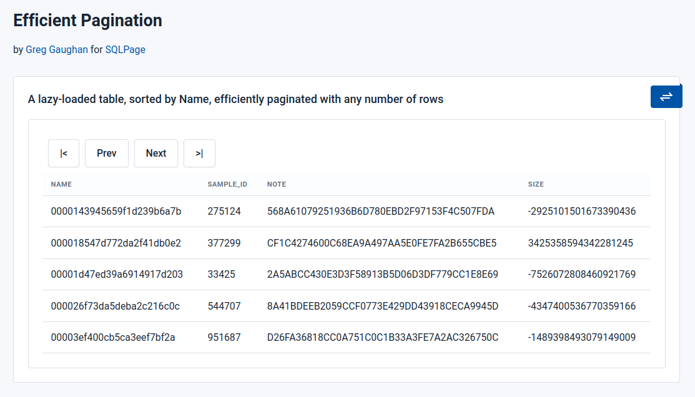

# Efficient Pagination

This example shows how pagination can be fast, regardless of the size of the data. It requires [SQLPage](https://sql.ophir.dev/) v0.18.0 or above. It uses [htmx](https://htmx.org/) to reload only the table component, leaving the rest of the html intact while paging through the results. 

**Note:** On first run, the initial migration will create a large `sample` table with a million rows. This could take a minute or two and use around 160MB, unless you first adjust the maximum row count in the `0001_create_sample.sql` file. Maybe try it with billions of rows if you have the space: the pagination speed should be as fast regardless. This example uses SQLite but it should easily port to PostgreSQL.

The usual pagination methods rely on an SQL `OFFSET` to a row-position which is bad because:

  * it causes the database server to page through the sorted results discarding everything up to the offset which:

    * flushes out pages from the database cache that could be used for useful things and other users
    * leads to lots of wasted I/O as it possibly sorts and then discards the first portion of the results (and so increases disk and memory contention)
    * takes a long time for large datasets, especially if there's no index (which is typically the case since small test cases seem to work just fine and only slow down much later on in production)
    * the work is re-done *every* time a page is requested

  * it takes no account of changes made to the data since the paginated row-positions were calculated (what was once page 43 could well now be page 42 or 50, or not exist, depending on what's been inserted and deleted)

  * the initial page calculations typically involve a count of all the rows (and is re-done every time a page is read)

The method used here assumes a suitable index exists on the order-by columns and uses the first/last values on the current page to give efficient keyset pagination that also adjusts to any background table changes. The down-sides are:

  * the sort-order we use is coded into the query (and it must end in a tie-breaker column, i.e. must be unique) and so we only support a single ordering, for now. Adding a reverse of this ordering is straightforward, though possibly verbose, and hasn't been done in this example yet.

  * we lose the typical list of page numbers and the ability to jump to them. However:

    * such page numbers can become stale on busy tables
    * do we really care that we're on page 236 of 3 million pages?
    * lots of page numbers won't fit anyway, and `...` is not much use
    * we could still show an estimated row count, if required and fast enough (and calculate it once outside the pagination area)

To do:

  * re-enable the search to pass the filter value as a parameter to feed into the query (filtering large paginated results shouldn't be done in the front-end)

  * add a reverse-sort option

  * add support for other sort-orders (most likely a pre-defined list based on existing indexes, and most likely involving more hard-coding per table)

  * look ahead 1 in each direction to predict the Prev/Next button availability to disable the buttons accordingly as well as detecting/preventing table wraparound.

  * check `_sqlpage_order_key` is an ok name

  * look at using parameters to fill in the prev/next hrefs (`&page_next={{page_next}}`) and using htmx boost to allow pagination to work without javascript (assuming SQLPage itself still works without it), and possibly with more browser history.
